## Triton Bench 实验指导手册

[TOC]

### 前言

- **Triton Bench是啥？**：Triton Bench发在**ACL 2025**上的一个数据集，测试大模型生成Triton算子的能力。
- **Triton Bench有啥用？**：研究**Kernel Code Agent**的一个重要的数据集，很新(2025)，很适合用来上手，顺带还可以学习(复习)一下triton。

### 租服务器

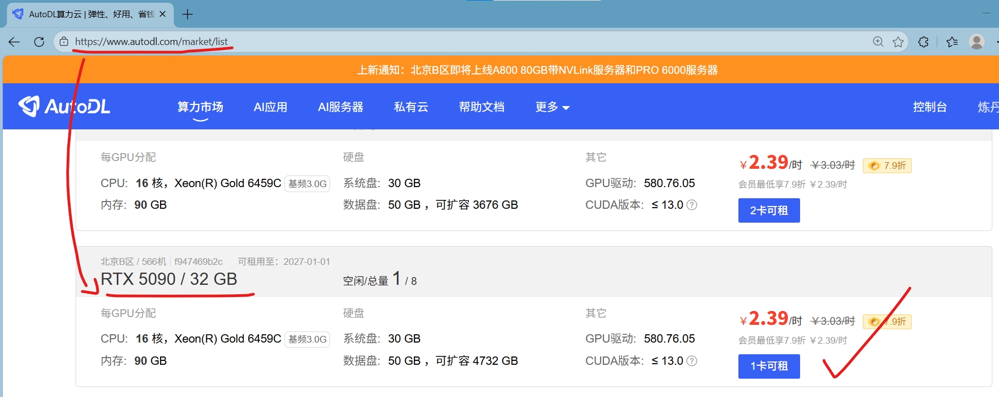

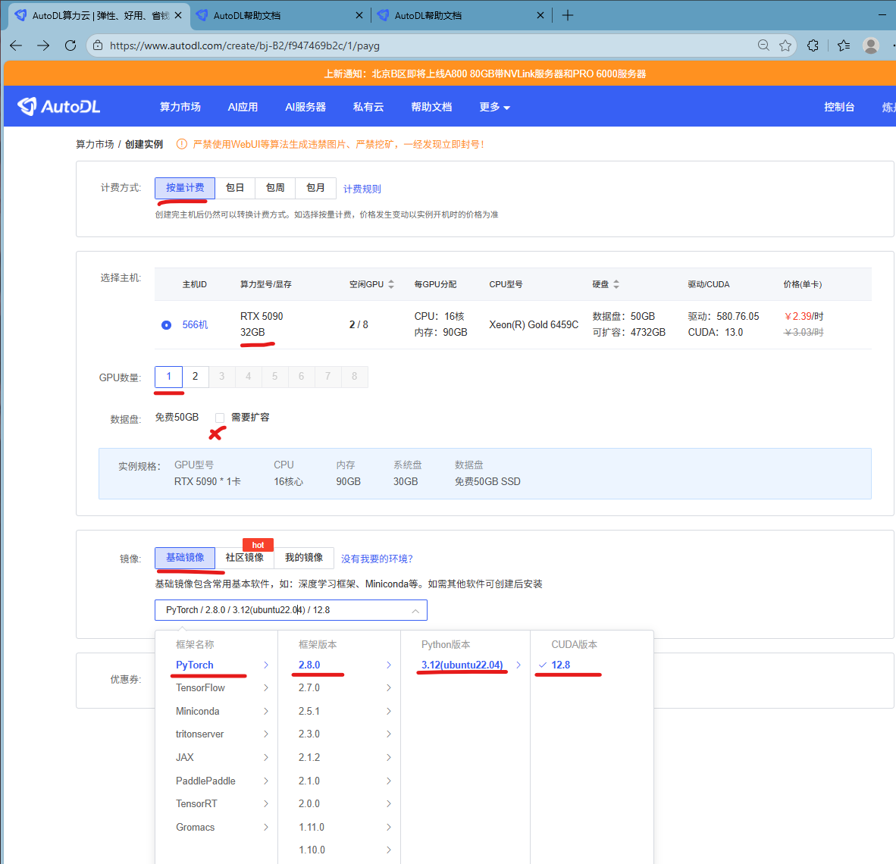

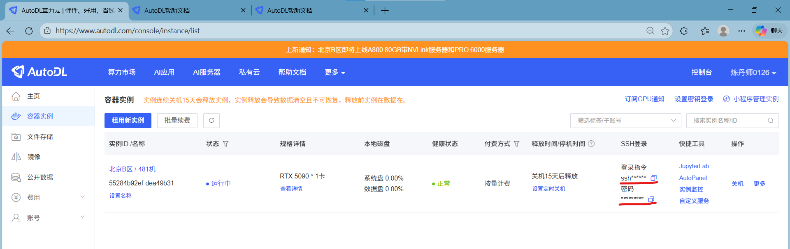

### 远程登录服务器

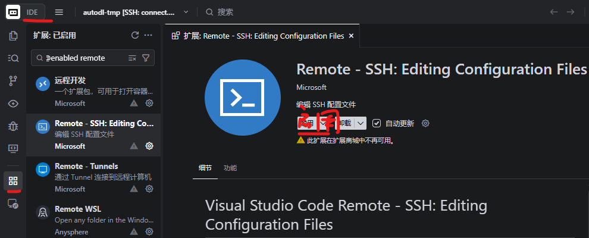

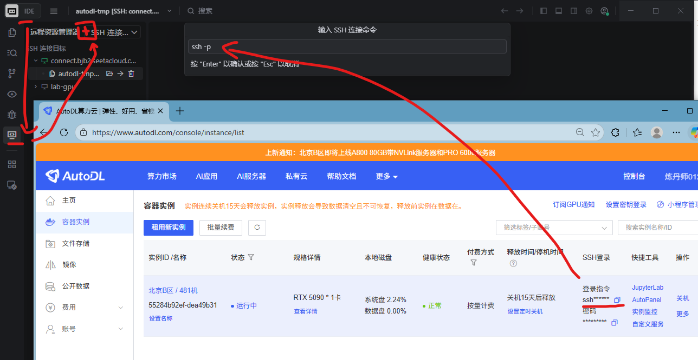

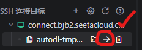

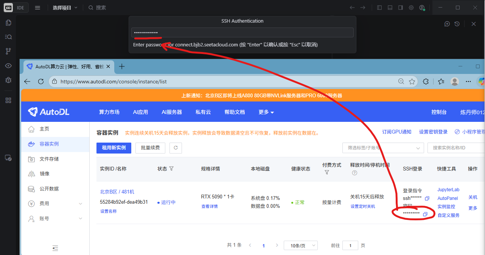

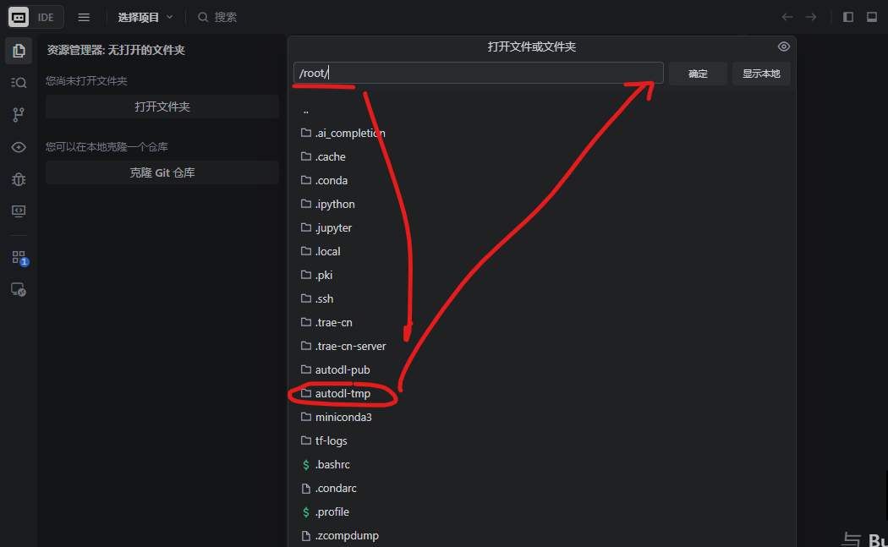

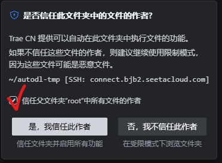

### ssh登录

```powershell
# 主机powershell[注意不是在服务器执行]查看一下有没有生成过id_rsa.pub
ls $env:USERPROFILE\.ssh\id_rsa.pub
# 如果没有生成，执行下面这句，有yes输yes，然后狂按回车
ssh-keygen -t rsa
# 服务器免登录指令
cat $env:USERPROFILE\.ssh\id_rsa.pub | ssh -p 端口号 root@服务器IP地址 "mkdir -p ~/.ssh && cat >> ~/.ssh/authorized_keys"
```

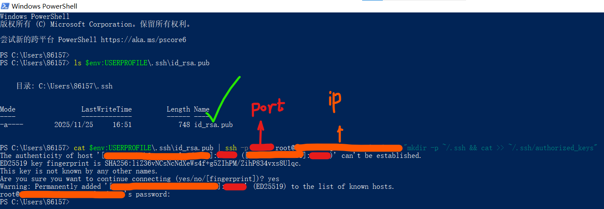

- 上面的操作等价于手动把`id_rsa.pub`复制到服务器的`~/.ssh/authorized_keys`文件

- 首先在本地把公钥打印，然后复制
  ```shell
  cat $env:USERPROFILE\.ssh\id_rsa.pub
  ```

  

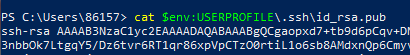

- 拷贝到服务器。[海蓬莱注：这里的公钥仅在视频演示期间有效]

```shell
mkdir -p ~/.ssh
echo "id_rsa.pub的内容，从ssh-rsa到最后一行" >> ~/.ssh/authorized_keys
```

### 查看服务器配置

提示：接下来可能要在服务器安装python或Jupiter NoteBook的插件，有提示就安装就行。

```shell
echo "--- [GPU 概览] ---" && nvidia-smi --query-gpu=name,memory.total,driver_version,compute_cap --format=csv,noheader && \
echo -e "\n--- [CPU 概览] ---" && lscpu | grep "Model name" | sed 's/Model name:[ ]*//' && \
echo -e "\n--- [内存概览] ---" && free -h | awk '/^Mem:/ {print "总计: "$2", 已用: "$3", 剩余: "$4}' && \
echo -e "\n--- [存储盘概览] ---" && df -h | grep -E '(/$|autodl-tmp)' | awk '{print $6": 总计 "$2", 已用 "$3", 剩余 "$4}' && \
echo -e "\n--- [环境核心版本] ---" && pip list | grep -E '^(torch|triton|transformers|accelerate)'
```

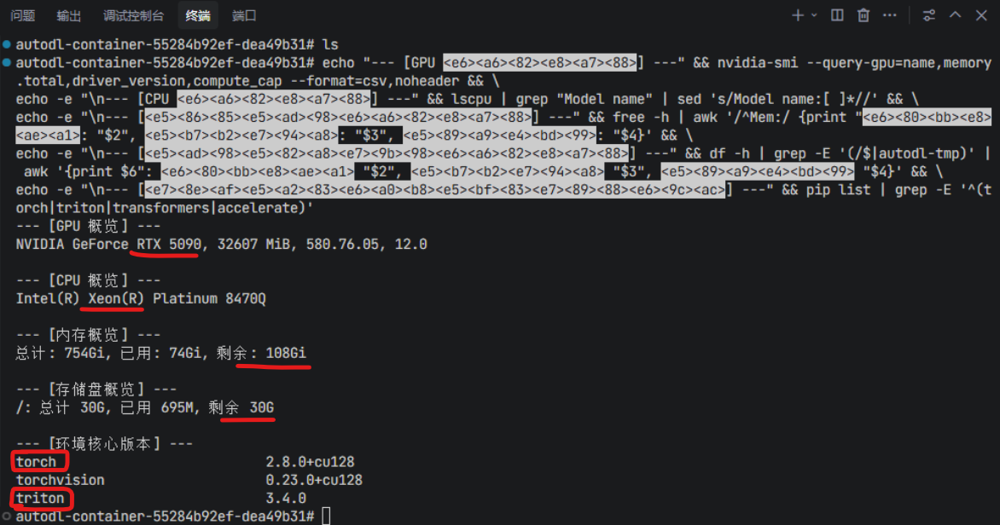

```python
import torch
import triton
import platform

print(f"操作系统: {platform.platform()}")
print(f"Python 版本: {platform.python_version()}")
print(f"PyTorch 版本: {torch.__version__}")
print(f"Triton 版本: {triton.__version__}")

if torch.cuda.is_available():
    print(f"\n✅ CUDA 已就位!")
    print(f"显卡型号: {torch.cuda.get_device_name(0)}")
    print(f"显卡算力: {torch.cuda.get_device_capability(0)}")
    print(f"当前显存占用: {torch.cuda.memory_allocated(0) / 1024**2:.2f} MB")
    
    # 5090 专属：验证 FP8 支持 (Blackwell 核心特性)
    print(f"硬件是否支持 FP8: {torch.cuda.get_device_capability(0) >= (10, 0)}")
else:
    print(f"❌ 警告: CUDA 未识别，请检查驱动！")
```

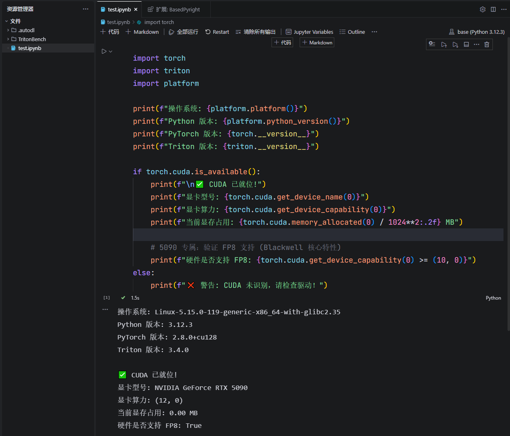

### 下载Triton Bench GitHub仓库

先给联网加个速[只在当前端口生效] [服务器不方便配置代理]

```shell
source /etc/network_turbo
```

```shell
git clone https://github.com/thunlp/TritonBench
```

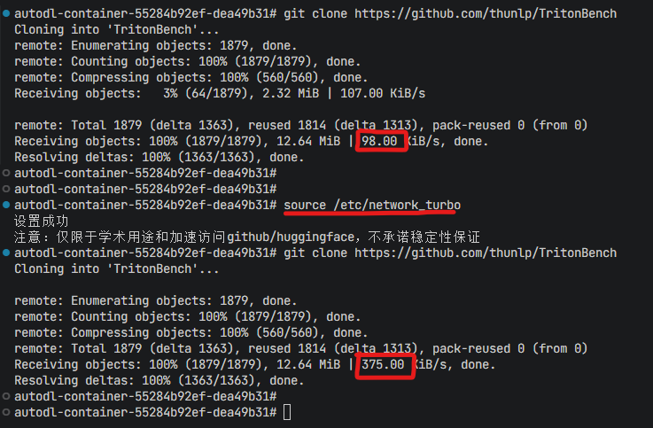

### 项目结构理解


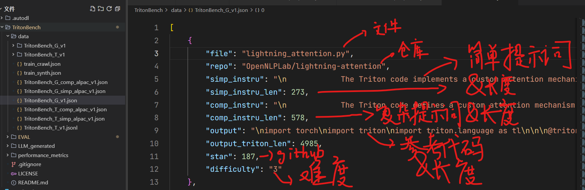

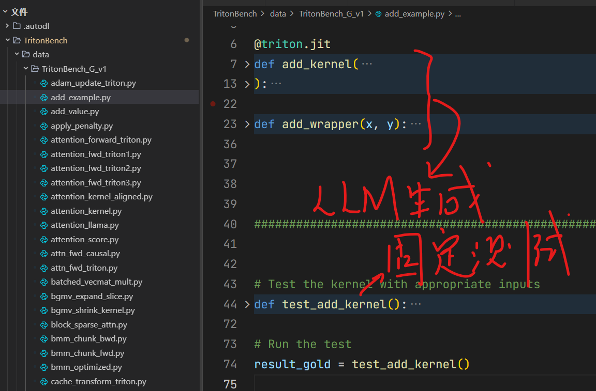

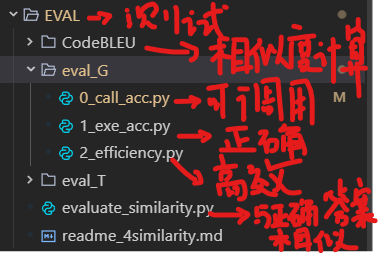

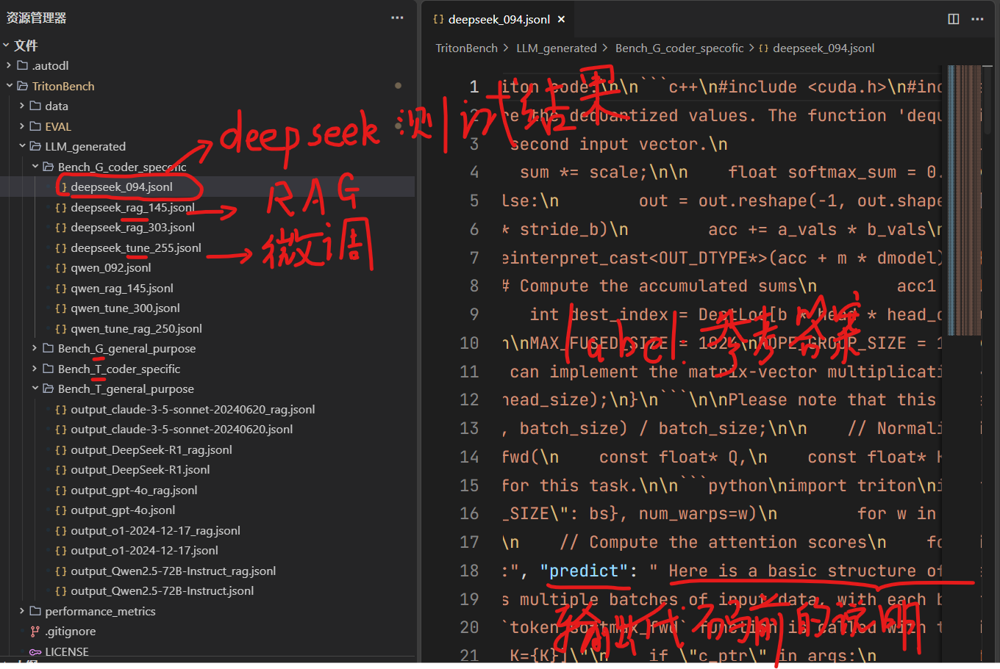

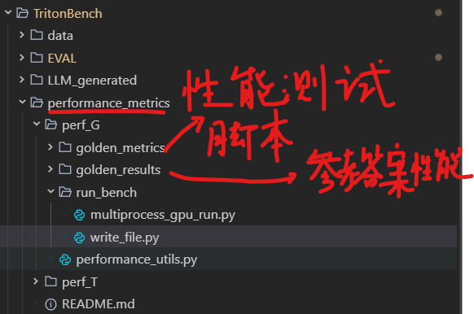


### 测试作者已生成的算子

#### 可调用性测试

由于作者已经提供了一些大模型生成的算子，比如说deepseek生成的`TritonBench/LLM_generated/Bench_G_coder_specofic/deepseek_094.jsonl`，所以我们没有必要一开始就让大模型再次生成，所以先可以测试一下作者生成的这些算子的效果如何。首先需要去测试可调用性，也就是函数可以被编译通过。

根据README，首先要去`TritonBench/EVAL/eval_G/0_call_acc.py`和`TritonBench/EVAL/eval_G/1_exe_acc.py`修改`py_interpreter`变量，改成

```python
"/root/miniconda3/bin/python"
```

对于AutoDL 5090这个服务器，通常来说，python解释器就是位于这个位置。

去根目录下执行：

```shell
python EVAL/eval_G/0_call_acc.py \
  --source LLM_generated/Bench_G_coder_specofic/deepseek_094.jsonl \
  --target EVAL/eval_results/deepseek_094 \
  --GPUs 0
```

然后会发现通过率是0%，这是因为仔细观察一下，一个重要的原因是模型在代码之前说了很多的废话，被合并到了代码当中。

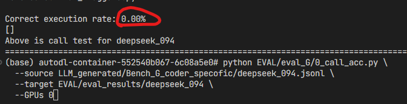

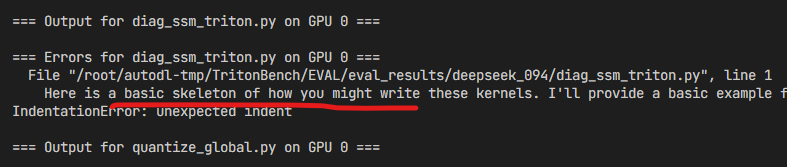


由于模型的算子必须要通过测试才会被添加进来，所以模型生成的算子都会被删掉，因为全部都是错的。就会导致最终的这个文件夹是空的文件夹。由于模型的算子全部编译都不通过，所以测试的速度很快。

然后测试

```shell
python EVAL/eval_G/0_call_acc.py \
  --source LLM_generated/Bench_G_coder_specofic/deepseek_rag_303.jsonl \
  --target EVAL/eval_results/deepseek_rag_303 \
  --GPUs 0
```

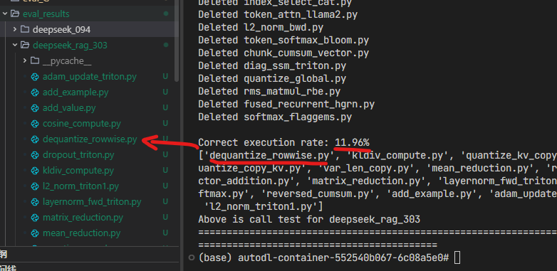

可以发现这个模型生成的代码的效果更好，就导致了有大概12%的代码是跑通了，然后加入到了最终的文件夹当中，由于有一些代码跑通了，而运行这个代码的测试是比较花时间的，所以测试就不会有原来的那么快。

#### 正确性测试

接下来需要去测试算子的正确性，而测试的算子并不是所有的算子，只需要去测试可以被调用的算子。也就是说我们只需要传入之前生成的算子，进行正确性测试即可。

```shell
python EVAL/eval_G/1_exe_acc.py \
  --folder EVAL/eval_results/deepseek_rag_303 \
  --GPUs 0
```

因为这个测试比较耗时而且是没有太多的提示输出的，所以可以去查看一下显存的占用`nvidia-smi`。会发现一开始是没有太多的功耗的，一旦测试开启之后，发现这个瓦数上升了，说明正在测试。大概等了几分钟之后，就可以看到这个结果了，不难发现，所有算子都测试通过了。

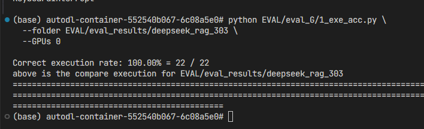

#### 效率测试

效率测试作者用的是8卡环境的并行测试，但是我们的AutoDL租的5090只有单卡，所以这步测试在这个章节就不测了，放到后面再考虑。

### 准备好API：以OpenRouter为例

- 选择**OpenRouter**是因为它对Gemini、Claude、gpt御三家支持，而七牛云和硅基流动主要只支持deep seek这类模型还有开源模型。而且现在我发现OpenRouter买API还是方便的[可以用微信]。这里演示的时候，我就以OpenRouter为例，其他几家完全一样。

- 去这里，确保有API剩余额度。

```http
https://openrouter.ai/settings/credits
```

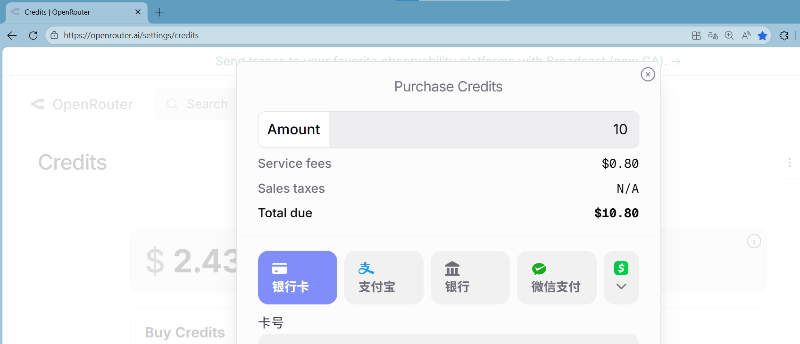

- 去这里创建一个api key

```http
https://openrouter.ai/settings/keys
```

- 复制api key，粘贴到代码框。
  (如果获取不到这个代码，可以把这个api-key还有模型的名称告诉ai，告诉他这个是open router的Api，然后让他现场写一个，这也是可以的)

- 然后在搜索框里面搜一下你想要调用的模型名字，选择其中一个，点击一下这个复制，把它复制在模型名字。这里我选deepseek。
  （注意，服务器如果去调用Gemini的话，可能会出现地区不可用，所以这里还是用deepseek）

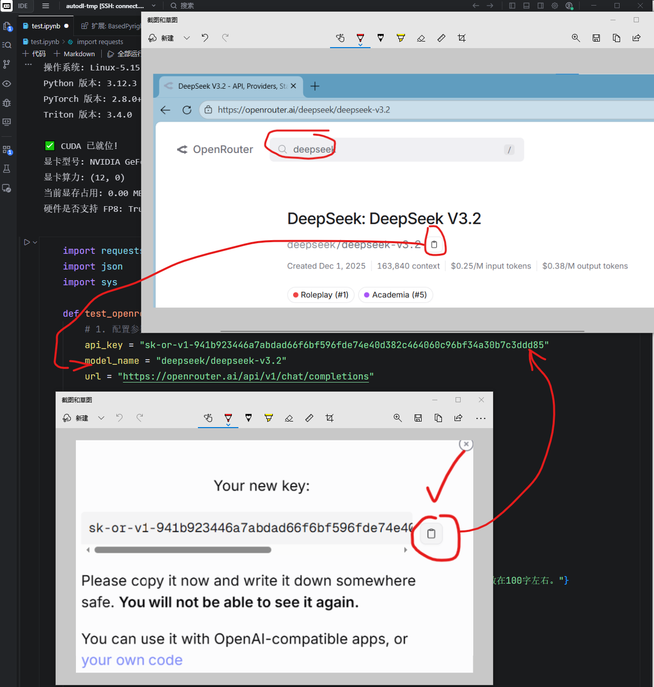

```python
import requests
import json
import sys
import re

def test_openrouter_triton_demo():
    # 1. 配置参数
    api_key = "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"
    model_name = "deepseek/deepseek-v3.2" # 也可以换成 deepseek/deepseek-r1 获取更强逻辑
    url = "https://openrouter.ai/api/v1/chat/completions"

    # 【优化：强制 AI 闭嘴的提示词】
    # 我们加入 System 角色，并要求只输出代码块，不解释
    user_content = """
    Write a Triton kernel for element-wise addition as described: 
    - Kernel: `add_kernel(in_ptr0, in_ptr1, out_ptr, n_elements, BLOCK_SIZE: tl.constexpr)`
    - Wrapper: `add_wrapper(x, y)`
    
    IMPORTANT: Output ONLY the code within a single ```python code block. 
    Do not provide any introductory text or explanation. 
    Do not say "Here is the code". Just start with the code.
    """

    headers = {
        "Authorization": f"Bearer {api_key}",
        "Content-Type": "application/json",
    }

    payload = {
        "model": model_name,
        "messages": [
            {"role": "system", "content": "You are a professional Triton GPU programmer. Output only code, no conversational text."},
            {"role": "user", "content": user_content}
        ],
        "stream": True 
    }

    print(f"--- 正在调用 {model_name} 生成 Triton 算子 ---\n")

    full_response = ""
    try:
        response = requests.post(url, headers=headers, data=json.dumps(payload), stream=True)
        
        if response.status_code != 200:
            print(f"请求失败: {response.text}")
            return

        print("AI 实时生成中:\n" + "-"*30)
        for line in response.iter_lines():
            if line:
                line_str = line.decode('utf-8')
                if line_str.startswith("data: "):
                    data_content = line_str[6:]
                    if data_content.strip() == "[DONE]": break
                    
                    try:
                        chunk_json = json.loads(data_content)
                        content = chunk_json['choices'][0].get('delta', {}).get('content', '')
                        if content:
                            full_response += content
                            sys.stdout.write(content)
                            sys.stdout.flush()
                    except: continue

        print("\n" + "-"*30 + "\n生成完毕！正在格式化输出...\n")

        # 【后处理：提取代码并格式化为 JSON 字符串】
        # 提取 ```python ... ``` 之间的内容
        code_match = re.search(r"```python\s+(.*?)\s+```", full_response, re.DOTALL)
        if code_match:
            raw_code = code_match.group(1).strip()
        else:
            raw_code = full_response.strip()

        # 生成可以直接粘贴进 JSON 的转义字符串（包含 \n 和 \t）
        json_ready_string = json.dumps(raw_code)

        print("==== 一键粘贴到 JSON 'predict' 字段的内容 ====")
        print(json_ready_string)
        print("============================================")

    except Exception as e:
        print(f"发生错误: {e}")

if __name__ == "__main__":
    test_openrouter_triton_demo()
```

- 在服务器上面点击运行，测试一下有没有输出。
  （相当于是从服务器向 api的提供方发送一个请求，让deepseek对于提示词，进行一个回复。如果看到回复输出在控制台就说明成功了。）

### 测试新算子的正确率

由于之前测试过这个`deepseek_094`通过率为0也就是全部都失败了，其中有一个很重要的原因是因为他的这个提示词当中没有把代码的段严格的抠出来，而我们换了一个新的提示词，这个提示词当中，让他严格闭嘴，不要多说，相当于只输出代码。
具体而言，我们要求这个模型生成的问题，其实是来自于这个G这一个数据集当中的第138号问题。

而我们需要做的就是把原来的这一个json文件复制一份，然后把其中的138号问题的答案也就是这个predict。给替换掉

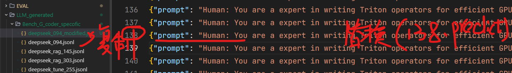

然后再次测试，此时会发现正确率提高了0.54%这就说明我们的新的代码生效了。

```shell
python EVAL/eval_G/0_call_acc.py \
  --source LLM_generated/Bench_G_coder_specofic/deepseek_094_modified.jsonl \
  --target EVAL/eval_results/deepseek_094_modified \
  --GPUs 0
```

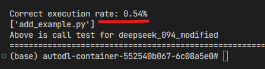

到此为止，如果我们能用自己的ai生成一个更好的答案，并且放到这个测试框架当中测试，发现它的正确率从零变成了一，那么整个复现就成功了。

### 未来工作

- 跑通多卡并行的性能测试脚本化

- 生成所有算子，一口气全部测试

现在的测试没有用hugging face的datasets，但是其实这个数据集在hugging face上面说datasets的，所以呢，用datasets大概率会更快一些

