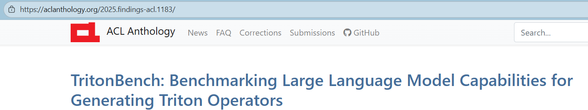
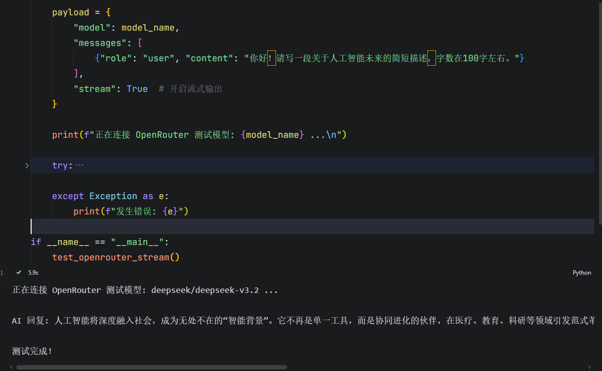

## Triton Bench 复现指导手册

### 前言



- **Triton Bench是啥？**：Triton Bench发在**ACL 2025**上的一个数据集，测试大模型生成Triton算子的能力。
- **Triton Bench有啥用？**：研究**Kernel Code Agent**的一个重要的数据集，很新(2025)，很适合用来上手，顺带还可以学习(复习)一下triton。
- **为什么选择5090？**：
  - **论文一致**：原作者在论文当中使用的是**A100**，然后GitHub中指出`triton = 3.1.0`，`torch >= 2.5.1`，之前旧的环境改起来比较麻烦，而**AutoDL**的预配置环境直接满足了，省去了配`pytorch+triton`的步骤。
  - **完全可复现**：如果用自己的电脑或者服务器，看视频跟着做可能遇到环境不一致的报错，而统一环境后连代码和指令都一摸一样[有些时候遇到问题，我也会重新看我自己的视频]。
- **为什么选择通用API产商**：
  - **实验需要**：因为这个Triton Bench需要去测试不同大模型的算子生成能力，就需要去调各家模型的API。
  - **一站式**：而如果每一个模型都要去找不同的产商（比如gpt找openai，Gemini找Google），就太麻烦了，但是通用API产商，例如**openrouter**、**七牛云**、**硅基流动**一个网站里就可以调遍各家API。

### 租服务器


### 远程登录服务器


### 小技巧：防止服务器老是让输入密码

```powershell
# 主机powershell[注意不是在服务器执行]查看一下有没有生成过id_rsa.pub
ls $env:USERPROFILE\.ssh\id_rsa.pub
# 如果没有生成，执行下面这句，有yes输yes，然后狂按回车
ssh-keygen -t rsa
# 服务器免登录指令
cat $env:USERPROFILE\.ssh\id_rsa.pub | ssh -p 端口号 root@服务器IP地址 "mkdir -p ~/.ssh && cat >> ~/.ssh/authorized_keys"
```


- 上面的操作等价于手动把`id_rsa.pub`复制到服务器的`~/.ssh/authorized_keys`文件

- 首先在本地把公钥打印，然后复制
  ```shell
  cat $env:USERPROFILE\.ssh\id_rsa.pub
  ```

  


- 拷贝到服务器。[海蓬莱注：这里的公钥仅在视频演示期间有效]

```shell
mkdir -p ~/.ssh
echo "id_rsa.pub的内容，从ssh-rsa到最后一行" >> ~/.ssh/authorized_keys
```

### 查看服务器配置

```shell
echo "--- [GPU 概览] ---" && nvidia-smi --query-gpu=name,memory.total,driver_version,compute_cap --format=csv,noheader && \
echo -e "\n--- [CPU 概览] ---" && lscpu | grep "Model name" | sed 's/Model name:[ ]*//' && \
echo -e "\n--- [内存概览] ---" && free -h | awk '/^Mem:/ {print "总计: "$2", 已用: "$3", 剩余: "$4}' && \
echo -e "\n--- [存储盘概览] ---" && df -h | grep -E '(/$|autodl-tmp)' | awk '{print $6": 总计 "$2", 已用 "$3", 剩余 "$4}' && \
echo -e "\n--- [环境核心版本] ---" && pip list | grep -E '^(torch|triton|transformers|accelerate)'
```


```python
import torch
import triton
import platform

print(f"操作系统: {platform.platform()}")
print(f"Python 版本: {platform.python_version()}")
print(f"PyTorch 版本: {torch.__version__}")
print(f"Triton 版本: {triton.__version__}")

if torch.cuda.is_available():
    print(f"\n✅ CUDA 已就位!")
    print(f"显卡型号: {torch.cuda.get_device_name(0)}")
    print(f"显卡算力: {torch.cuda.get_device_capability(0)}")
    print(f"当前显存占用: {torch.cuda.memory_allocated(0) / 1024**2:.2f} MB")
    
    # 5090 专属：验证 FP8 支持 (Blackwell 核心特性)
    print(f"硬件是否支持 FP8: {torch.cuda.get_device_capability(0) >= (10, 0)}")
else:
    print(f"❌ 警告: CUDA 未识别，请检查驱动！")
```


### 准备好API：以OpenRouter为例

- 选择**OpenRouter**是因为它对Gemini、Claude、gpt御三家支持，而七牛云和硅基流动主要只支持deep seek这类模型还有开源模型。而且现在我发现OpenRouter买API还是方便的[可以用微信]。你这里演示的时候，我就以OpenRouter为例，其他几家完全一样。

- 去这里，确保有API剩余额度。

```http
https://openrouter.ai/settings/credits
```


- 去这里创建一个api key

```http
https://openrouter.ai/settings/keys
```

- 复制api key，粘贴到代码框。
  (如果获取不到这个代码，可以把这个api-key还有模型的名称告诉ai，告诉他这个是open router的Api，然后让他现场写一个，这也是可以的)

- 然后在搜索框里面搜一下你想要调用的模型名字，选择其中一个，点击一下这个复制，把它复制在模型名字。这里我选deepseek。
  （注意，服务器如果去调用Gemini的话，可能会出现地区不可用，所以这里还是用deepseek）


```python
import requests
import json
import sys

def test_openrouter_stream():
    # 1. 配置参数(海蓬莱备注：这个api_key仅在我演示期间生效)
    api_key = "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"
    model_name = "deepseek/deepseek-v3.2"
    url = "https://openrouter.ai/api/v1/chat/completions"

    headers = {
        "Authorization": f"Bearer {api_key}",
        "Content-Type": "application/json",
        # OpenRouter 建议包含这两个 Header 以便在他们的排行榜上显示你的应用（可选）
        "HTTP-Referer": "https://localhost:3000", 
        "X-Title": "API Test Script"
    }

    payload = {
        "model": model_name,
        "messages": [
            {"role": "user", "content": "你好！请写一段关于人工智能未来的简短描述，字数在100字左右。"}
        ],
        "stream": True  # 开启流式输出
    }

    print(f"正在连接 OpenRouter 测试模型: {model_name} ...\n")

    try:
        # 2. 发起请求
        response = requests.post(url, headers=headers, data=json.dumps(payload), stream=True)
        
        # 检查 HTTP 状态码
        if response.status_code != 200:
            print(f"请求失败！状态码: {response.status_code}")
            print(response.text)
            return

        # 3. 处理流式返回
        print("AI 回复: ", end="")
        for line in response.iter_lines():
            if line:
                # 移除 "data: " 前缀内容
                line_str = line.decode('utf-8')
                if line_str.startswith("data: "):
                    data_content = line_str[6:]
                    
                    # 检查是否传输结束
                    if data_content.strip() == "[DONE]":
                        break
                    
                    try:
                        chunk_json = json.loads(data_content)
                        # 提取内容部分
                        delta = chunk_json['choices'][0].get('delta', {})
                        content = delta.get('content', '')
                        
                        # 实时打印到控制台
                        if content:
                            sys.stdout.write(content)
                            sys.stdout.flush()  # 强制刷新缓冲区，实现逐字输出效果
                    except Exception as e:
                        continue

        print("\n\n测试完成！")

    except Exception as e:
        print(f"发生错误: {e}")

if __name__ == "__main__":
    test_openrouter_stream()
```

- 在服务器上面点击运行，测试一下有没有输出。
  （相当于是从服务器向 api的提供方发送一个请求，让deepseek对于这句话"你好，请写一个关于人工智能未来的简短描述"，进行一个回复。如果看到回复输出在控制台就说明成功了。）



### 下载Triton Bench GitHub仓库

先给联网加个速[只在当前端口生效]

```shell
source /etc/network_turbo
```

```shell
git clone https://github.com/thunlp/TritonBench
```


